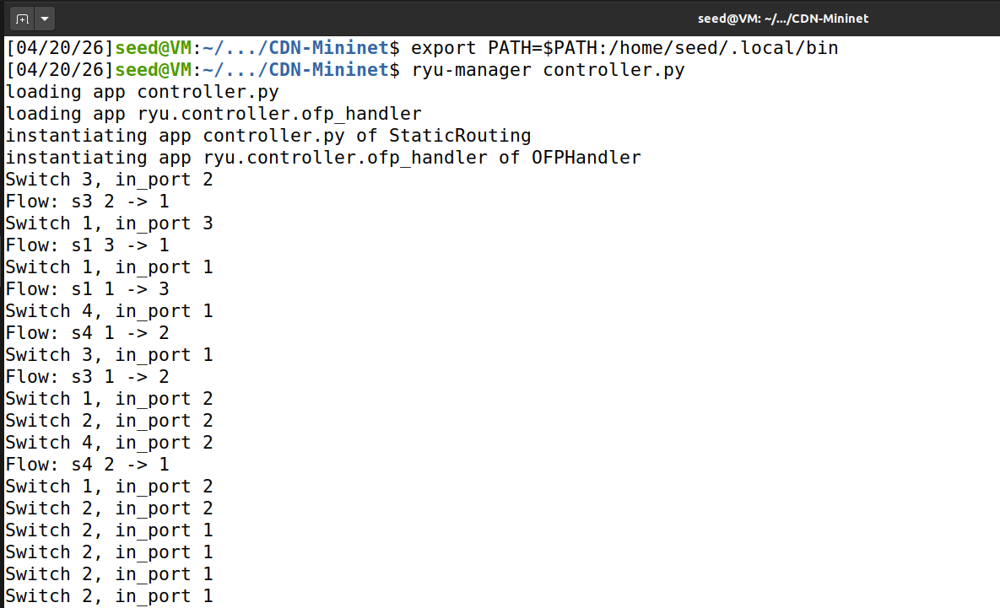
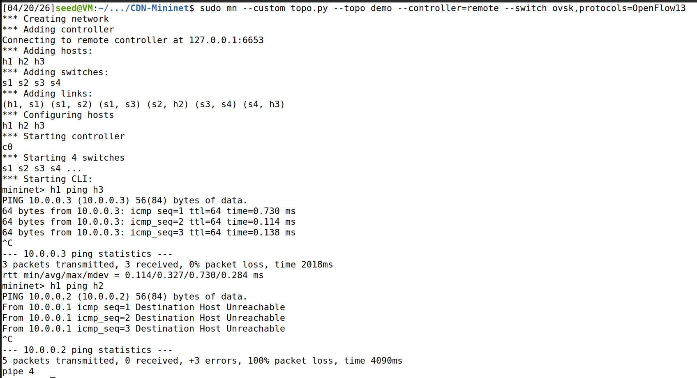
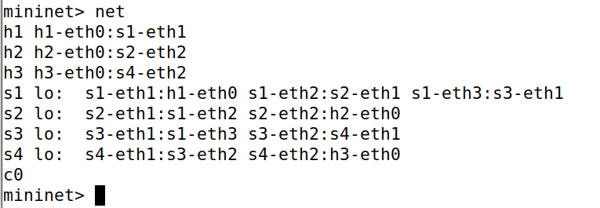
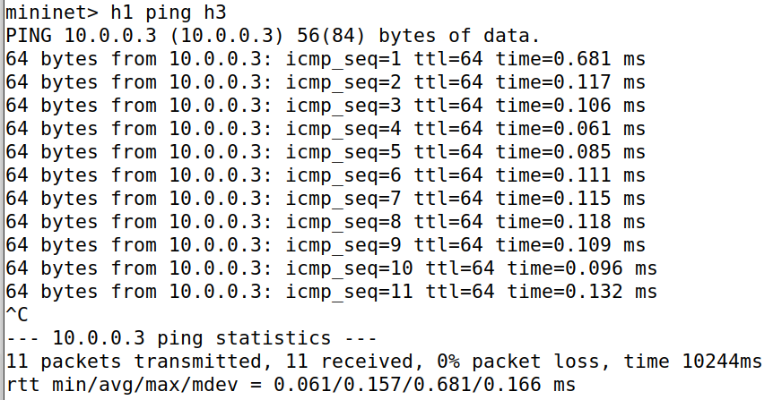
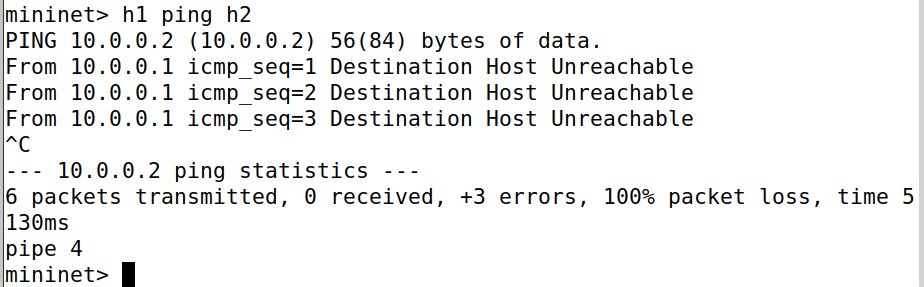
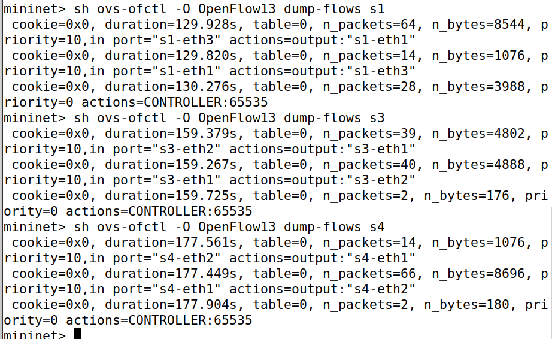
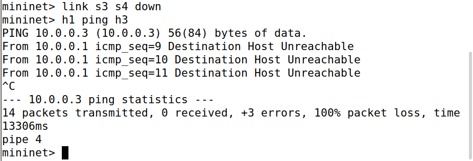

# Static Routing using SDN Controller in Mininet

> **Course:** Computer Networks — UE24CS252B
> **Name:** Akshaya M | **SRN:** PES2UG24CS050 | **Sec:** A

---

## Problem Statement

This project implements **static routing** using a **Software Defined Networking (SDN)** controller in a simulated network environment built with Mininet and the Ryu controller framework.

Key demonstrations:
- Controller–switch interaction via OpenFlow 1.3
- Flow rule (match–action) design and installation
- Controlled and predictable network behavior
- Static path enforcement without dynamic routing

> Unlike traditional networks, routing decisions are made **centrally by the controller** rather than by distributed routers.

---

## Objectives

- Design a custom network topology using **Mininet**
- Implement an SDN controller using **Ryu**
- Manually define routing paths using **OpenFlow flow rules**
- Analyze network behavior under **normal and failure conditions**

---

## Tools & Technologies

| Tool | Description |
|------|-------------|
| Mininet | Network emulator for creating virtual topologies |
| Ryu | Python-based SDN controller framework |
| Open vSwitch (OVS) | Software-based OpenFlow-capable switch |
| Ubuntu / Linux | Host operating system |
| OpenFlow 1.3 | Protocol for controller-switch communication |

---

## Project Structure

```
SDN-MiniNet/
├── controller.py
├── topo.py
├── README.md
└── Screenshots/
    ├── runningcontroller.png
    ├── runningmininet.png
    ├── net.png
    ├── h1toh3.png
    ├── h1toh2.png
    ├── flowrules.png
    └── linkdown.png
```

---

## Setup & Execution

### Prerequisites

```bash
sudo apt-get install mininet -y
pip install ryu --break-system-packages
```

### Step 1: Start the Ryu Controller

Open **Terminal 1**:

```bash
export PATH=$PATH:/home/seed/.local/bin
ryu-manager controller.py
```



### Step 2: Start Mininet

Open **Terminal 2**:

```bash
sudo mn --custom topo.py --topo demo --controller=remote --switch ovsk,protocols=OpenFlow13
```



### Step 3: View Network

```
mininet> net
```



---

## Network Topology

```
         h1 (10.0.0.1)
              |
             s1
           /    \
          s2     s3
           \    /
            s4
           /  \
   h2 (10.0.0.2)  h3 (10.0.0.3)
```

### Static Path Enforced

```
h1 → s1 → s3 → s4 → h3
```

The path through `s2` is intentionally **not routed**.

---

## Results & Observations

### Scenario 1 — Successful Routing (h1 → h3)

```bash
mininet> h1 ping h3
```



- 0% packet loss
- Static path `h1 → s1 → s3 → s4 → h3` followed

---

### Scenario 2 — Unused Path (h1 → h2)

```bash
mininet> h1 ping h2
```



- 100% packet loss — Destination Host Unreachable
- Confirms `s2` path is intentionally not programmed

---

### Scenario 3 — Flow Table Verification

```bash
mininet> sh ovs-ofctl -O OpenFlow13 dump-flows s1
```



- Priority=10 rules installed for static path
- Priority=0 table-miss rule sends unknown packets to controller

---

### Scenario 4 — Failure Scenario

```bash
mininet> link s3 s4 down
mininet> h1 ping h3
```



- 100% packet loss after link brought down
- No automatic rerouting — confirms static routing behavior

---

## Analysis

| Aspect | Observation |
|--------|-------------|
| Path Predictability | Fixed, deterministic path every time |
| Centralized Control | All decisions made by Ryu controller |
| Fault Tolerance | No automatic failover on link failure |
| Flow Validation | dump-flows confirms correct rule installation |
| Alternate Path | s2 never receives flow rules — h2 unreachable |

---

## Conclusion

This project successfully demonstrates SDN-based static routing using Ryu + OpenFlow 1.3, controller-driven flow rule installation, fixed path enforcement, and predictable failure behavior with no dynamic rerouting.

---

## References

- [Mininet Documentation](http://mininet.org/walkthrough/)
- [Ryu Controller Documentation](https://ryu.readthedocs.io/)
- [OpenFlow Specification](https://opennetworking.org/sdn-resources/openflow/)
- Course Notes — Computer Networks UE24CS252B, PES University
